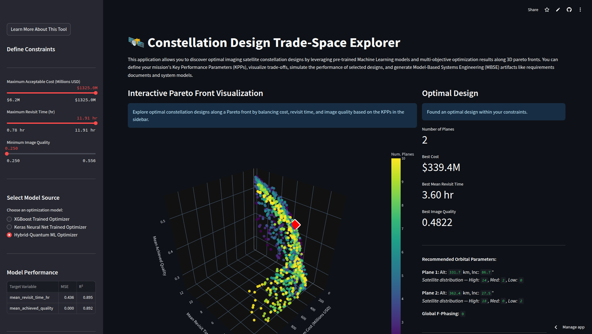
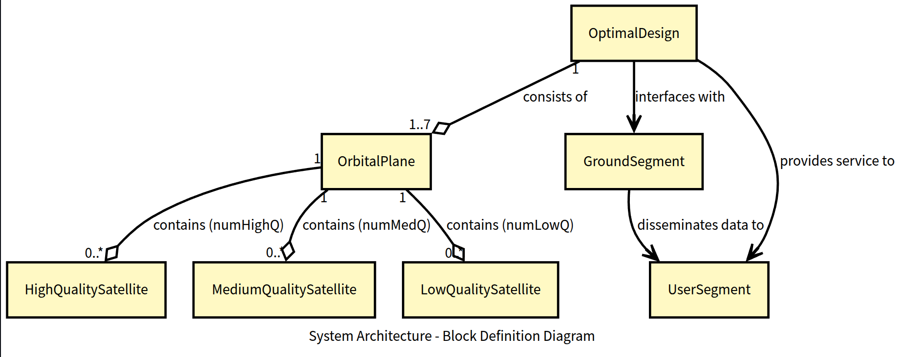

# Satellite Constellation Design Trade-Space Explorer

## Overview

The Satellite Constellation Design Trade-Space Explorer is a Python-based application that leverages Machine Learning and physics-based simulations to help users discover optimal designs for Earth observation imaging satellite constellations. Designing such constellations is a multifaceted challenge, requiring a delicate balance between performance metrics like coverage (revisit time) and image quality, against constraints like system cost and complexity.

**Project Goal:**
To provide an interactive tool for mission planners, systems engineers, and researchers to:
*   Explore a vast design space of satellite constellations.
*   Understand the trade-offs between key performance parameters (KPPs) and cost.
*   Identify optimal constellation configurations based on user-defined constraints.
*   Visualize and simulate the performance of selected designs.
*   Generate Model-Based Systems Engineering (MBSE) artifacts for further system development.

**Try the live application:** [**Constellation Optimizer on Streamlit Cloud**](https://constellation-optimizer.streamlit.app/)


## Key Features

*   **Interactive Pareto Front Visualization:** Explore 3D Pareto fronts (Cost vs. Revisit Time vs. Quality) generated by multi-objective optimization algorithms.
*   **User-Defined KPPs:** Filter designs based on maximum acceptable cost, maximum revisit time, and minimum image quality.
*   **Optimal Compromise Identification:** Automatically highlights the best-balanced design within the user's constraints.
*   **Multiple ML Model Backends:** Supports designs optimized using different ML models:
    *   XGBoost
    *   Keras Neural Network (with KerasTuner for hyperparameter optimization)
    *   Hybrid Quantum-Classical ML Model (PennyLane & TensorFlow, with KerasTuner)
*   **Detailed Simulation:** Perform physics-based simulations of selected designs using Poliastro and Astropy for accurate performance assessment.
*   **3D Globe Visualization:** Interactively view satellite orbits and initial positions on a 3D Earth model.
*   **MBSE Artifact Generation:**
    *   **Requirements Document (CSV):** Export KPPs and derived requirements, compatible with tools like DOORS or JAMA.
    *   **System Architecture Model (XMI):** Generate SysML v2-compliant XMI files for import into modeling tools (e.g., Cameo, Papyrus).
    *   **Block Definition Diagram (BDD):** Automatically view a SysML BDD of the selected system architecture.

## Tech Stack & Core Libraries

*   **Simulation & Orbital Mechanics:** Python, Poliastro, Astropy
*   **Machine Learning:** Scikit-learn, XGBoost, TensorFlow/Keras, PennyLane
*   **Hyperparameter Optimization:** KerasTuner
*   **Multi-Objective Optimization:** Pymoo (NSGA-II algorithm)
*   **Data Handling & Numerics:** Pandas, NumPy
*   **Web Application & UI:** Streamlit
*   **Visualization:** Plotly, Graphviz (for BDD)
*   **MBSE Artifacts:** Standard XML libraries (for XMI generation)
*   **Image Handling (for Globe Texture):** Pillow
*   **Environment Management:** uv

## Project Structure

The project is organized into several key Python scripts and data files:

*   `app.py`: The main Streamlit web application.
*   `constellation_sim.py`: Core logic for defining satellite hardware, building constellations, and calculating revisit time and image quality using Poliastro.
*   `generate_training_dataset.py`: Script to generate the extensive training dataset by simulating thousands of random constellation configurations.
*   `baseline_ml_model.py`: Trains the XGBoost model.
*   `neural_net_model.py`: Trains the Keras Neural Network model.
*   `quantum_model.py`: Trains the Hybrid Quantum-Classical ML model.
*   `baseline_optimizer.py`: Runs multi-objective optimization using the trained XGBoost model.
*   `nn_optimizer.py`: Runs multi-objective optimization using the trained Keras NN model.
*   `quantum_optimizer.py`: Runs multi-objective optimization using the trained Quantum-Hybrid model.
*   `mbse_utils.py`: Contains functions to generate MBSE artifacts (Requirements CSV, XMI model, BDD DOT string).
*   **Data Files (`.csv`):**
    *   `constellation_training_data_cleaned.csv`: The cleaned dataset used for training ML models.
    *   `*_optimizer_pareto_fronts.csv`: Stores the Pareto-optimal solutions from different optimizers.
    *   `model_performance_metrics.csv`: Contains MSE and R² scores for the trained ML models.
*   **Saved Models & Scalers (`.joblib`, `.keras`, `.h5`):** Pre-trained ML models, feature/target scalers, and hyperparameters.
*   **Assets:**
    *   `earth_map.jpg`: Texture file for the 3D globe visualization.  Credit to NASA Visible Earth: https://visibleearth.nasa.gov/collection/1484/blue-marble

## How It Works: Workflow

The application and its underlying models follow a comprehensive workflow:

1.  **Data Generation (`generate_training_dataset.py`):**
    *   Thousands of diverse satellite constellation designs are randomly generated. Parameters include number of planes, satellites per plane, altitude, inclination, and satellite type mix (high, medium, low quality).
    *   Each design is simulated using `constellation_sim.py` (which leverages Poliastro for orbital mechanics) to calculate:
        *   Mean Revisit Time over a global grid of ground points.
        *   Mean Achieved Image Quality.
    *   System costs (hardware, launch) are calculated based on `SATELLITE_OPTIONS` and `LAUNCH_COST_PER_KG_USD` defined in `constellation_sim.py`.
    *   A key validity criterion for a design during data generation is its ability to access at least 80% of a predefined global grid of ground points (latitudes -60° to +60°, longitudes -180° to +180°).
    *   The resulting dataset is saved (e.g., `constellation_training_data.csv`) and subsequently cleaned (resulting in `constellation_training_data_cleaned.csv`).

2.  **ML Model Training (e.g., `neural_net_model.py`, `quantum_model.py`):**
    *   The cleaned dataset is used to train various ML models (XGBoost, Keras NN, Quantum-Hybrid).
    *   These models learn to predict `mean_revisit_time_hr` and `mean_achieved_quality` based on input constellation parameters (altitudes, inclinations, satellite counts per type, and global F-phasing).
    *   `KerasTuner` is used for hyperparameter optimization of the Keras NN and Quantum-Hybrid models.
    *   Trained models, feature scalers, and target scalers are saved to disk.

3.  **Multi-Objective Optimization (e.g., `nn_optimizer.py`):**
    *   A pre-trained ML model is loaded.
    *   The NSGA-II genetic algorithm (from Pymoo) explores the design space to find Pareto-optimal fronts.
    *   The optimization process seeks to:
        *   Minimize Total System Cost.
        *   Minimize Mean Revisit Time.
        *   Maximize Mean Achieved Image Quality.
    *   The resulting Pareto-optimal solutions are saved to CSV files (e.g., `nn_optimizer_pareto_fronts.csv`).

4.  **Streamlit Application (`app.py`):**
    *   Loads the Pareto-optimal solutions from one of the optimizer output files.
    *   Allows the user to select which ML model's optimization results to explore.
    *   Displays an interactive 3D Pareto front plot (Plotly).
    *   Users define their Key Performance Parameters (KPPs) using sidebar sliders.
    *   The application filters the solutions based on these KPPs and highlights an "Optimal Compromise" design.
    *   Detailed parameters of this optimal design are displayed.
    *   **Simulation & Visualization:**
        *   Users can trigger a detailed, physics-based simulation of the selected design using `constellation_sim.py`.
        *   Results (simulated revisit time, quality, coverage) are displayed.
        *   An interactive 3D globe visualizes the constellation's orbits and initial satellite positions.
    *   **MBSE Artifacts:**
        *   Generates a Requirements Document (CSV).
        *   Generates a System Architecture Model (XMI).
        *   Displays an auto-generated SysML Block Definition Diagram (BDD).

## Example Usage and Visualizations:

1.  **Streamlit Application Interface:**

    

    *Description: The main dashboard allowing users to define constraints and explore constellation designs.*

2.  **Interactive Pareto Front Explorer:**

    

    *Description: Users can navigate the 3D trade-space of cost, revisit time, and quality. Points are colored by the number of orbital planes.*

3.  **3D Orbit Visualization:**

    

    *Description: An interactive 3D view of the selected constellation's orbits around the Earth, with satellites colored by type.*

4.  **SysML System Architecture Diagram (BDD):**

    

    *Description: A SysML BDD illustrating the system's components (e.g., Constellation, Orbital Planes, Satellite Types, Ground Segment) and their relationships.*

## MBSE Artifacts

The application facilitates a Model-Based Systems Engineering approach by generating:

*   **Requirements Document (CSV):** Captures KPPs and derived system/performance requirements. Formatted for easy import into requirements management tools like IBM DOORS or JAMA Connect.
*   **System Architecture Model (XMI):** An XML Metadata Interchange (XMI) file representing the system architecture in SysML. This can be imported into various SysML modeling tools (e.g., Cameo Systems Modeler, Papyrus) for further refinement and analysis.
*   **Block Definition Diagram (BDD):** An automatically generated visual representation of the system's block structure and relationships, displayed directly in the application.

## Setup and Usage

1.  **Clone the Repository:**
    ```bash
    git clone <your-repository-url>
    cd <repository-directory>
    ```

2.  **Install `uv` (if you haven't already):**
    `uv` is a fast Python package installer and resolver, written in Rust.
    Follow the installation instructions at https://github.com/astral-sh/uv.
    For example, on macOS and Linux:
    ```bash
    curl -LsSf https://astral.sh/uv/install.sh | sh
    ```

3.  **Create and Activate a Virtual Environment using `uv`:**
    ```bash
    uv venv
    source .venv/bin/activate  # On Windows: .venv\Scripts\activate
    ```
    *(This creates a virtual environment in a `.venv` folder in your project directory.)*

4.  **Install Dependencies using `uv`:**
    You will need to create a `requirements.txt` file based on the imports in the Python scripts. Key libraries include: `streamlit`, `pandas`, `numpy`, `plotly`, `poliastro`, `astropy`, `scikit-learn`, `xgboost`, `tensorflow`, `pennylane`, `keras-tuner`, `pymoo`, `graphviz`, `Pillow`.
    ```bash
    uv pip install -r requirements.txt
    ```
    *Note: Ensure you have Graphviz installed on your system if you want the BDD to render correctly locally (Streamlit Cloud handles this automatically).*

5.  **Initial Setup for `constellation_sim.py`:**
    The project originally used a file named `python-qec-deo.py`. If you are setting this up from scratch or adapting, ensure this core simulation logic is available as `constellation_sim.py` in the project root. This file must define `SATELLITE_OPTIONS` with `cost`, `mass`, and other parameters for each satellite type.

6.  **Ensure Assets are Present:**
    *   Place the `earth_map.jpg` file in the root directory of the project for the 3D globe texture.

7.  **Running the Application:**
    The application can be run using the pre-computed optimization results and ML model performance metrics provided in the repository.
    ```bash
    streamlit run app.py
    ```
    Open your web browser and navigate to the local URL provided by Streamlit (usually `http://localhost:8501`).

8.  **(Optional) Regenerating Data and Models:**
    If you wish to regenerate the training data, train new ML models, or run the optimizers:
    *   Execute `python generate_training_dataset.py`. **Warning:** This is computationally intensive and can take a very long time.
    *   Perform data cleaning steps to produce `constellation_training_data_cleaned.csv` (the exact script for this step might need to be created or is part of other scripts).
    *   Run the respective ML model training scripts (e.g., `python neural_net_model.py`).
    *   Run the respective optimizer scripts (e.g., `python nn_optimizer.py`).
    *   This will update the `.csv`, `.joblib`, `.keras`, and `.h5` files.

## Future Work & Potential Enhancements

*   **Advanced Cost Modeling:** Incorporate more detailed cost components for the ground segment, user segment, operations, and maintenance.
*   **Expanded Design Space:**
    *   Include more diverse satellite bus and payload options.
    *   Allow optimization of other orbital elements (e.g., eccentricity, argument of perigee, RAAN distribution strategies).
*   **Detailed Ground Segment Simulation:** Model ground station visibility, contact times, and data downlink capacities.
*   **Link Budget Analysis:** Integrate calculations for signal strength and data rates.
*   **Enhanced MBSE Integration:** Direct API connections to specific MBSE tools or platforms.
*   **User Accounts & Collaboration:** Allow users to save designs, share scenarios, and collaborate.
*   **STK Integration:** Implement API connections to Systems Tool Kit (STK) for advanced orbital simulation, detailed dynamic event analysis, and richer animation capabilities beyond initial satellite state visualization.
*   **Mission-Specific Optimizations:** Tailor optimization objectives and constraints for different mission types (e.g., persistent surveillance, rapid revisit, specific regional coverage).
*   **Broader ML Algorithm Exploration:** Investigate and benchmark other machine learning algorithms (e.g., Gaussian Processes, Support Vector Regression, different ensemble methods) as well as more advanced Quantum Machine Learning (QML) architectures for predicting constellation performance.

## License

`MIT`

## Author / Contact

`[Your Name / GitHub Username]`
`[Link to your GitHub Profile]`
